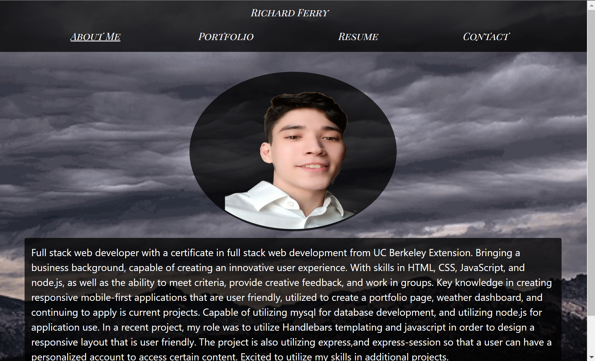

# react-portfolio       [](https://opensource.org/licenses/MIT)
The following is an application that allows the user to view a portfolio page. Included within the portfolio are information about the creator of the application such as, about,resume, GitHub, email, phone number, and links to recent projects.



# Table of Contents
- [Features](#features)
- [Technologies](#technologies)
- [Instructions](#instructions)
- [Requirements](#requirements)
- [Installing](#installing)
- [Live Deployment](#live-deployment)
- [Aurthor](#aurthor)
- [Resources](#resources)
- [License](#license)

## Features 
* Responsive Design
* Links to projects
* Navigation bar for quick access to sections


## Technologies
* HTML/CSS
* Bootstrap
* React

## Instructions
A quick walk-through to download the application. Once Installation is complete the file can be edited to include different images or text.

### Requirements
* IDE capable of running HTML, CSS, JavaScript.
* Web browser(preferrably chrome).
* Node.js

### Installing
* Fork and clone the repository through your terminal. 
* Open the file, and perform a npm install in your terminal 
```bash
npm install
```
* At this point changes can be made if desired, or even change the document to include json content.
* To view the file perform a npm start in the terminal and open in a browser.


### Live Deployment
* [CLICK HERE](https://rich-f-p.github.io/react-portfolio/)

### Aurthor
Richard Ferry
* [LinkedIn](https://www.linkedin.com/in/richard-ferry-83120514b/)
* [Github](https://github.com/rich-f-p)
* [email](mailto:richardfpro864@gmail.com)

### Resources
* Bootstrap
* React

### License
* [License: MIT](https://opensource.org/licenses/MIT) : click to learn more